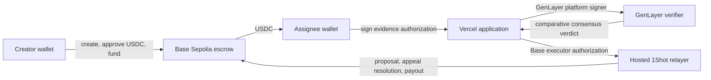

# Milestone Judge

Milestone Judge is a decentralized USDC milestone escrow and evidence-review
application running on Base Sepolia and GenLayer StudioNet.

An organization or individual creates an event, assigns a recipient wallet,
defines natural-language milestones, selects the USDC amount and minimum score
for each milestone, and locks the complete budget in the Base escrow contract.
The assignee submits public evidence, GenLayer reaches comparative consensus on
the evidence, and the Base contract releases only the milestone amount whose
approved score meets the funded threshold.

Production application:
`https://ma-milestone-verifier.vercel.app`

> This deployment uses public test networks and test USDC. The contracts have
> not been presented as audited for mainnet use.

## Live Deployment

| Component | Network | Address or endpoint |
| --- | --- | --- |
| Milestone escrow | Base Sepolia, chain ID `84532` | `0x47F846c659B4DF565d2e8b1cd32F610E68d11B9A` |
| USDC | Base Sepolia | `0x036CbD53842c5426634e7929541eC2318f3dCF7e` |
| Evidence verifier | GenLayer StudioNet | `0x4006FA705a70BF9137e7B5d07555b6E547Cae5c5` |
| Hosted relayer | 1Shot | `https://relayer.1shotapi.dev/relayers` |
| Web application | Vercel | `https://ma-milestone-verifier.vercel.app` |

Deployment transactions and the latest end-to-end smoke record are maintained
in [`docs/deployment.md`](docs/deployment.md).

## What The Application Does

- Creates an event for one assigned wallet.
- Stores event title, deadline, terms document reference, creator, and assignee
  on Base Sepolia.
- Adds up to 50 immutable natural-language milestones before funding.
- Assigns an exact USDC amount and minimum GenLayer score from 1 to 100 to each
  milestone.
- Locks the aggregate USDC budget when the creator activates the event.
- Shows assignees only events delegated to their connected wallet.
- Shows creators only events created by their connected wallet.
- Accepts public HTTPS and IPFS evidence.
- Lets the assignee authorize evidence without sending a blockchain
  transaction or switching wallet networks.
- Uses a server-only GenLayer signer to submit reviews.
- Returns a decision, score, detailed review, strengths, improvements,
  suggestions, citations, and evidence gaps.
- Uses hosted 1Shot to relay exact executor calls on Base Sepolia.
- Automatically starts Base settlement when an approved score meets the funded
  minimum.
- Automatically releases the exact milestone amount after the escrow's short
  required settlement interval.
- Releases each milestone once and only to the original assignee.
- Refunds only the unpaid event balance after the event deadline.
- Uses no application database, queue, cron job, or webhook persistence.

## Architecture



### Base Sepolia

`MilestoneEscrow.sol` is authoritative for:

- event ownership and assignment;
- milestone criteria hashes and text;
- milestone amounts and minimum scores;
- locked, paid, and refundable USDC;
- approval proposals and accepted scores;
- challenge deadlines and appeals;
- single-use payouts;
- owner, pause, and executor rotation.

### GenLayer StudioNet

`milestone_verifier.py` is authoritative for subjective review results. It:

- accepts review transactions only from the configured platform signer;
- treats submitted evidence as untrusted input;
- asks validators to inspect material public evidence;
- uses `gl.eq_principle.prompt_comparative`;
- normalizes the verdict before storing it on-chain;
- indexes the latest review for each Base event and milestone.

### Vercel Application

The application is a stateless coordinator. It:

- reads canonical event state from Base;
- reads review state from GenLayer;
- verifies assignee and creator signatures;
- validates signed requests against the funded Base milestone;
- submits GenLayer transactions with the server-only platform key;
- builds exact-call 1Shot delegations;
- never chooses the payout recipient or amount.

Vercel is not a canonical datastore. Restarting or redeploying the application
does not remove event, review, or escrow state.

## Roles And Trust Boundaries

### Event creator

- Creates the event and milestones.
- Selects each score threshold.
- Locks the full USDC budget.
- May challenge a proposed approval during the challenge window.
- May claim the unpaid balance after the event deadline.

### Assignee

- Sees events assigned to the connected wallet.
- Submits public milestone evidence.
- Signs an off-chain evidence authorization.
- Receives an exact milestone payout when settlement succeeds.

### GenLayer platform signer

- Is held only in the Vercel production secret environment.
- Is the only account accepted by the GenLayer verifier for `request_review`.
- Does not create events, fund USDC, or sign Base settlement calls.
- Has one job: submit authorized review requests to GenLayer.

### Base settlement executor

- Is separate from the GenLayer platform signer.
- Is the Base escrow `platformExecutor`.
- Signs the EIP-7702 authorization and exact delegations used by hosted 1Shot.
- Can call only executor-gated settlement methods.
- Cannot change the funded assignee or milestone amount.

### Contract owner

- Can pause the Base escrow.
- Can start two-step ownership or executor rotation.
- Owns the GenLayer verifier and can rotate its platform signer.

## Event Lifecycle

1. The creator calls `createEvent`.
2. The creator calls `addMilestones` with criteria, amounts, and minimum scores.
3. The creator approves USDC and calls `fundAndActivate`.
4. The assignee submits evidence and signs EIP-712 typed data.
5. The API verifies the signature and funded milestone state.
6. The GenLayer-only platform signer calls GenLayer `request_review`.
7. GenLayer validators produce and compare independent verdicts.
8. If the decision is approved and the score meets the threshold, the Vercel
   coordinator automatically asks hosted 1Shot to record the approval.
9. After the immutable escrow's short required timestamp interval, the same
   server request automatically asks 1Shot to call `releaseMilestone`.
10. The escrow transfers the exact funded amount to the assignee.

Rejected, inconclusive, or below-threshold results do not create a payout
transaction. The assignee may submit materially improved evidence before expiry.

## Evidence Authorization And Wallet Networks

Requesting a GenLayer review is not a Base transaction.

The assignee signs typed data containing:

- event ID;
- milestone ID;
- attempt ID;
- funded criterion hash;
- evidence hash;
- random nonce;
- expiry;
- deployed escrow address in the EIP-712 domain.

The EIP-712 domain intentionally does not contain a chain ID. A wallet connected
to another network can authorize evidence without receiving an
`Unrecognized chain ID "0x14a34"` error. The platform signer, not the assignee,
sends the GenLayer transaction.

Actual Base writes still enforce Base Sepolia before signing:

- create event;
- add milestones;
- approve USDC;
- activate funding;
- open appeal;
- claim refund.

For those writes the frontend:

1. reads `eth_chainId`;
2. calls `wallet_switchEthereumChain`;
3. detects top-level or nested `4902` and unknown-chain messages;
4. calls `wallet_addEthereumChain` with Base Sepolia metadata;
5. switches again and verifies chain ID `84532`.

## Duplicate Review Protection

- The submit button is disabled immediately while authorization is in progress.
- An in-memory ref rejects a second form submission before React rerenders.
- Pending review metadata is stored in browser local storage.
- Reloading or returning to the submission page opens the active review instead
  of submitting another one.
- The pending marker is removed when the GenLayer result becomes available.
- Review IDs are deterministic for identical evidence, so a finalized request
  is returned instead of being submitted again.
- Before every initial review, the server reads Base and rejects the request if
  an approval proposal or appeal is already active for that milestone.
- The GenLayer contract rejects an already stored review ID.

## GenLayer Verdict Schema

```json
{
  "decision": "approved | rejected | inconclusive",
  "score": 95,
  "criterion_met": true,
  "measurement_valid": true,
  "material_exception": false,
  "review": "Detailed evidence-grounded assessment",
  "explanation": "Concise decision summary",
  "strengths": ["Verified strength"],
  "improvements": ["Specific deficiency"],
  "suggestions": ["Actionable next step"],
  "citations": ["https://public-evidence.example"],
  "evidence_gaps": ["Missing corroboration"]
}
```

An approved result must have a score of at least 50, valid measurement, a met
criterion, no material exception, and at least one citation. The Base escrow
applies the creator's potentially higher funded score threshold.

## Hosted 1Shot Integration

The application uses the public hosted endpoint without a 1Shot API key and
without `ONESHOT_PAYMENT_TOKEN_ADDRESS`.

The settlement adapter calls:

- `relayer_getCapabilities`;
- `relayer_estimate7710Transaction`;
- `relayer_send7710Transaction`;
- `relayer_getStatus`.

It selects Base Sepolia USDC from the advertised capability, transfers the
quoted fee, and creates one exact-execution delegation per transaction entry.
The separate Base settlement executor needs Base Sepolia USDC for relay fees.

## Application Routes

| Route | Purpose |
| --- | --- |
| `/` | Public project landing page |
| `/app` | Connected-wallet overview |
| `/events/assigned` | Events assigned to the connected wallet |
| `/events/created` | Events created by the connected wallet |
| `/history` | Completed milestones and Base payout transaction hashes |
| `/events/new` | Create milestones and lock USDC |
| `/events/[id]` | Event and milestone state |
| `/events/[id]/milestones/[milestoneId]/submit` | Evidence authorization |
| `/events/[id]/milestones/[milestoneId]/appeal` | Creator appeal |
| `/reviews/[id]` | Pending consensus and finalized verdict |

## Repository Structure

```text
apps/web/                     Next.js frontend and stateless API routes
contracts/base/               Solidity escrow, deployment script, Foundry tests
contracts/genlayer/           Intelligent contract and direct tests
docs/                         Architecture, deployment, and operations
scripts/generate-platform-wallet.mjs
scripts/live-smoke.mjs
```

## Prerequisites

- Node.js `22.x`
- npm
- Foundry (`forge`, `cast`)
- `uv`/`uvx`
- GenLayer CLI
- An EVM wallet with Base Sepolia ETH and test USDC for creator actions
- A Vercel project for the production server signer

## Local Development

```bash
git clone https://github.com/TS-mfon/Milestone-Judge.git
cd Milestone-Judge
cp .env.example apps/web/.env.local
npm install
npm run dev
```

Open `http://localhost:3000`.

There is no demo-data fallback. Contract addresses must be configured and the
RPC endpoints must be reachable.

## Environment Variables

| Variable | Visibility | Description |
| --- | --- | --- |
| `NEXT_PUBLIC_BASE_RPC_URL` | Public | Base Sepolia JSON-RPC endpoint |
| `NEXT_PUBLIC_BASE_CHAIN_ID` | Public | Must be `84532` |
| `NEXT_PUBLIC_ESCROW_ADDRESS` | Public | Deployed `MilestoneEscrow` |
| `NEXT_PUBLIC_USDC_ADDRESS` | Public | Base Sepolia USDC |
| `NEXT_PUBLIC_GENLAYER_CONTRACT_ADDRESS` | Public | StudioNet verifier |
| `BASE_INDEX_START_BLOCK` | Server | Escrow deployment block |
| `GENLAYER_PLATFORM_PRIVATE_KEY` | Server secret | GenLayer review signer only |
| `BASE_EXECUTOR_PRIVATE_KEY` | Server secret | Hosted 1Shot Base executor only |
| `GENLAYER_NETWORK` | Server | `studionet` |
| `ONESHOT_API_URL` | Server | Hosted relayer URL |

Never expose either private key through a `NEXT_PUBLIC_` variable, commit it to
Git, or place it in preview deployments.

The live GenLayer-only review signer is
`0xAb48af420171CAd87b3A8EBa233C8F7ef4805BDb`. It has no Base settlement role.
The Base executor remains `0xEd9EDd8586b20524CafA4F568413C504C9B03172`.

## Commands

```bash
npm run dev
npm run lint
npm run typecheck
npm test
npm run build
npm run contracts:build
npm run contracts:test
npm run contracts:lint
npm run test:genlayer
npm run smoke:live -- --settle
```

## Contract Testing

Foundry tests cover:

- exact milestone payout;
- duplicate payout prevention;
- unauthorized executor rejection;
- score below threshold rejection;
- exact and above-threshold approval;
- appeal score enforcement;
- unpaid balance refunds.

GenLayer direct tests cover platform-only review submission and normalized
verdict storage. Frontend tests cover request validation and Base Sepolia
switch/add behavior, including the reported unrecognized-chain error.

## Deployment

Detailed commands are in [`docs/deployment.md`](docs/deployment.md).

At a high level:

1. Deploy or upgrade the Base escrow.
2. Deploy the GenLayer verifier with the platform signer address.
3. Confirm the separate Base executor and GenLayer platform signer.
4. Configure production Vercel variables.
5. Deploy Vercel.
6. Create and fund a live event.
7. Submit evidence and wait for comparative consensus.
8. Confirm the hosted 1Shot task and Base state transition.
9. Record all addresses and transactions.

## Security Invariants

- Milestones cannot change after funding.
- A payout recipient is always the funded assignee.
- The executor cannot choose a payout amount.
- A score below the funded threshold cannot propose or uphold approval.
- Open appeals block payout.
- Review and result hashes must match the proposal.
- A milestone cannot be paid twice.
- Refunds return only unpaid USDC to the creator.
- GenLayer review writes are restricted to the platform signer.
- Owner and executor rotation use explicit authorization boundaries.
- All application data remains recoverable from the two chains.

See [`docs/architecture.md`](docs/architecture.md) and
[`docs/runbook.md`](docs/runbook.md) for trust and incident details.

## Troubleshooting

### Unrecognized chain ID `0x14a34`

This chain ID is Base Sepolia. Evidence authorization no longer requires that
network. For actual Base writes, approve the wallet prompt to add and switch to
Base Sepolia.

### Review button remains unavailable

A review may already be pending. Open the current review from the submission
page and wait for GenLayer finalization.

### Review finalized but payout is still processing

The result must be approved and meet the milestone's on-chain minimum score.
Keep the verdict page open while hosted 1Shot confirms the approval and release
transactions. The completed payment and Base transaction hash then appear under
`/history`.

### Hosted settlement fails

Check the Base settlement executor's Base Sepolia USDC balance and query the returned
1Shot task ID with `relayer_getStatus`.

### Events do not appear

Connect the creator or assigned wallet. The API intentionally returns no public
event directory without a wallet filter.

## License

No open-source license has been added yet. Repository copyright remains with
the project owner.
